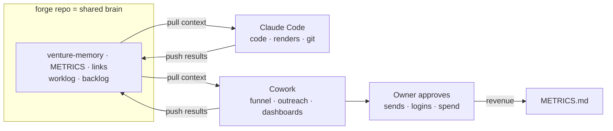

# OPERATIONS.md — how Cowork & Claude Code run Forge together

The operating system for the venture. Two Claude agents work the **same repo**:

- **Claude Code** — in your terminal / WSL, lives in the code.
- **Cowork** — the desktop app, lives on the web + desktop + connectors.

This doc is the contract that lets them run in parallel **without conflicts**, pointed
at one goal. Read it at the start of every session. `CLAUDE.md` is the short version;
this is the full protocol.

## The only goal that counts
We do not stop at "built." **Done = consistent, repeatable revenue.**
Milestones (track in `docs/METRICS.md`):

| | Milestone | Meaning |
|--|--|--|
| **M0** | Funnel live | Kit page + Gumroad↔Kit + IG bio wired; real URLs in `links.md` |
| **M1** | First $1 | Any stream takes money — the machine works |
| **M2** | First service build | A $300–1,500 done-for-you client |
| **M3** | First $500 month | Any mix of streams |
| **M4** | **Consistent** | 3 straight months of revenue → then scale |

## Two lanes (ownership map — prevents edit collisions)
| | **Claude Code** | **Cowork** |
|--|--|--|
| **Owns (edits)** | `src/`, `content/scripts/`, `content/product/templates/`, pipeline, `.github/` | `tracker/`, ops `docs/`, outreach + funnel execution, decks |
| **Does** | render batches, ffmpeg, YouTube upload, n8n exports, refactors, git | funnel wiring, outreach, publishing, dashboards, connectors, scheduled jobs |
| **Doesn't touch** | funnel/ops execution, dashboards | render pipeline / titan bridge code |

**Shared files (either agent, append-only):** `docs/venture-memory.md`,
`docs/METRICS.md`, `content/links.md`, `docs/worklog.md`, `docs/backlog.md`.

> Rule of thumb: **code or a render → Claude Code. Distribution, money, or a document →
> Cowork.** The shared files are the bus between them.

## The context bus (shared-state files)
- `docs/venture-memory.md` — decisions + phase log. **Append**, never rewrite history.
- `docs/METRICS.md` — every number (budget, revenue, funnel, channel). Source of truth.
- `content/links.md` — real URLs as accounts go live.
- `docs/worklog.md` — **the handoff log.** One short entry per session.
- `docs/backlog.md` — the routed task queue (`[CC]`/`[CW]`/`[OWNER]`). Pull from your lane.

## Session ritual (the no-conflict protocol)
**Start (60 seconds)**
1. `git pull` — always start from latest.
2. Read the top entry of `docs/worklog.md`; scan `docs/backlog.md`.
3. Claim 1–3 tasks tagged for your lane. If you must touch the other lane, note it in
   the worklog first.

**During**
- Only edit files in your lane (see map). Shared files are **append-only** — add, don't
  overwrite, so two sessions never clobber each other.
- One writer per file at a time; the latest worklog entry names the active agent.

**End (the handoff)**
1. Update the shared files you changed (METRICS, venture-memory, links).
2. Append a `docs/worklog.md` entry: what you did · what changed · what you're handing
   off · the next move.
3. `git add -A && git commit && git push` so the other agent starts from your work.

## Git discipline
- Work on `main` for ops/content. Use a short-lived `feat/*` branch only for risky
  pipeline changes (Claude Code), then merge.
- Commit prefix: `[CW]` or `[CC]` + imperative summary —
  e.g. `[CW] wire Gumroad→Kit, paste real links`.
- **Pull before work, push after.** Never leave a session uncommitted.
- Never commit secrets (titan `.env`, tokens) — `.gitignore` already guards these.

## Routing tags (used in `backlog.md`)
- `[CC]` Claude Code · `[CW]` Cowork · `[OWNER]` needs you (a login, a card, a send).
- `[CW→OWNER]` Cowork preps it; owner approves/sends (outreach emails, posts, uploads).

## If a conflict ever happens
- Shared files are append-only, so conflicts are rare and trivial — keep both halves.
- Code conflicts: Claude Code is authority on `src/`; Cowork on `tracker/` + ops `docs/`.
- Whoever hits it: resolve, note it in the worklog, recommit.

## Cadence
- **Daily 9am** — `forge-daily-ops` scheduled task: today's video + outreach + funnel gap.
- **Mon 9am** — `forge-weekly-metrics`: week review, updates METRICS + dashboard.
- **Per session** — the start/handoff ritual above.

## The loop

